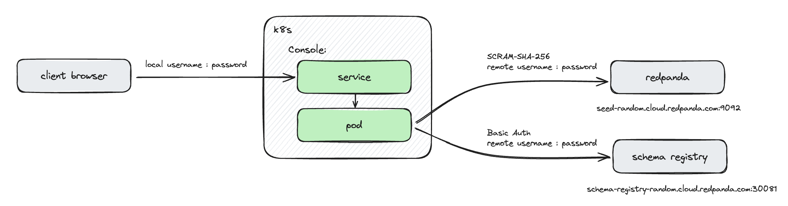

# Standalone Console Deployment Example

This project is intended to demonstrate how the Redpanda console can be deployed via Helm.

## Deployment Architecture

The diagram below shows the intended deployment architecture:



On the left, we can see a client accessing the Redpanda Console over http(s), which in turn connects to a Redpanda Cloud cluster for both schemas and topic data.

## Authentication

In this example, there are multiple credentials in use:

1. Users connect to Console using a locally defined username and password
2. Console connects to Redpanda brokers using a fixed username and password
3. Console connects to the Redpanda Schema Registry using a fixed username and password

### Local Users

These are defined within the [values.yaml](values.yaml) file:

```yaml
    login:
      enabled: true
      plain:
        enabled: true
        credentials:
          - username: local-user
            password: somethingsecure
```

The username used here should match the username within [config/role-bindings.yaml](config/role-bindings.yaml):

```yaml
roleBindings:
  - roleName: admin
    metadata:
      name: Administrators
    subjects:
      - kind: user
        provider: Plain
        name: local-user
```

### Broker / Schema Registry User

The user with which Redpanda Console will access both the brokers and schema registry is also defined in [values.yaml](values.yaml):

```yaml
console:
  config:
    console:
      maxDeserializationPayloadSize: 1048576
    kafka:
      brokers:
        - seed-random.redacted.fmc.prd.cloud.redpanda.com:9092
      clientId: redpanda-console
      sasl:
        enabled: true
        mechanism: SCRAM-SHA-256
        username: cloud-user
      tls:
        enabled: true
      schemaRegistry:
        enabled: true
        urls: ["https://schema-registry-random.redacted.fmc.prd.cloud.redpanda.com:30081"]
        username: cloud-user
        tls:
          enabled: true
```

The passwords for these accounts are also defined in [values.yaml](values.yaml), except that the chart will create a secret to hold them:

```yaml
secret:
  create: true
  kafka:
    saslPassword: REDACTED
    schemaRegistryPassword: REDACTED
```

## Authorization

Topic visibility is controlled by the ACLs in the Redpanda brokers.

## License

You will need to put your Redpanda license file in [secrets/redpanda.license](secrets/redpanda.license).

## Scripts

There are two scripts in this example:

- [deploy.sh](deploy.sh): this script creates the k8s namespace, creates a config map (for role bindings), creates a k8s secret (for the Redpanda license file) and deploys the Console via Helm 
- [access.sh](access.sh): this script was used during testing to create a local port forward rule - it is unlikely to be needed for a production deployment

## Customisation

A complete reference to the Redpanda Console Helm Chart for further customisation can be found [here](https://github.com/redpanda-data/helm-charts/tree/main/charts/console).